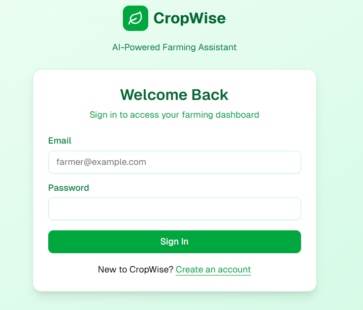
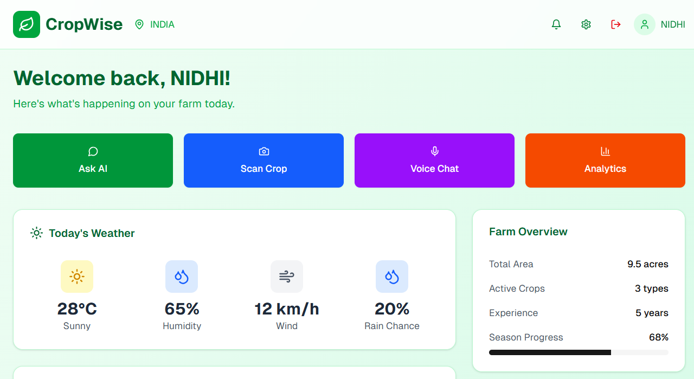
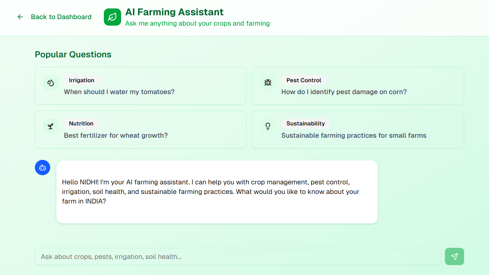
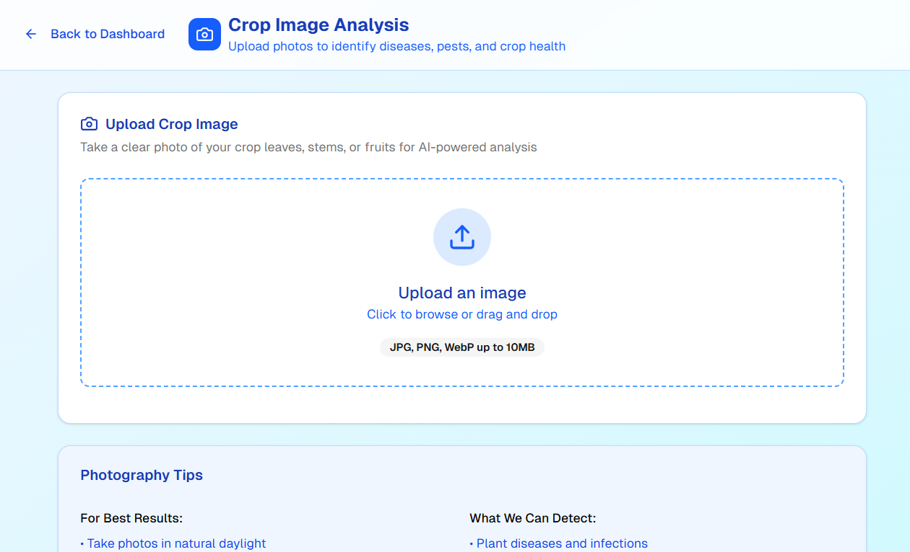
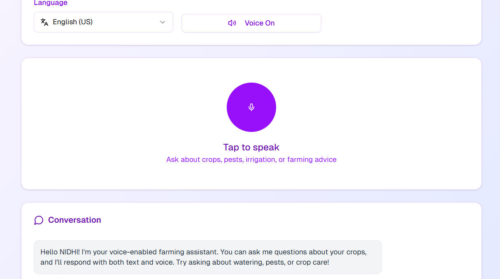
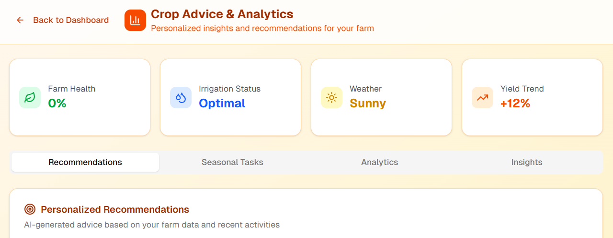

# AnveshanProject-Farmer-Crop-advise-with-login-and-Imageanalysis
CropWise is an AI-powered farming assistant that delivers instant crop care guidance. Farmers can log in to access a smart chatbot for personalized agricultural advice. Upload crop images to receive real-time disease detection and health analysis. Empowering farmers with data-driven insights to improve yield and reduce crop loss.

 Features

 Core Functionality <br>
- User Authentication - Secure login/signup with Supabase Auth  <br>
- Farmer Dashboard - Real-time metrics, weather data, and quick access to AI tools <br> 
- AI Chat Assistant - Conversational AI powered by Groq for agricultural expertise  <br>
- Image Analysis - AI-powered crop disease and pest identification  <br>
- Voice Interface - Multi-language voice interactions with speech recognition  <br>
- Analytics & Insights- Personalized crop advice and yield optimization  <br>
 
 Prerequisites
- Node.js 18+ and npm
- Supabase account
- Groq API account

 Installation


Supabase Configuration <br>
NEXT_PUBLIC_SUPABASE_URL=your_supabase_url <br>
NEXT_PUBLIC_SUPABASE_ANON_KEY=your_supabase_anon_key <br>
SUPABASE_SERVICE_ROLE_KEY=your_supabase_service_role_key <br>

 Groq Configuration
GROQ_API_KEY=your_groq_api_key

 Database Configuration (Auto-configured with Supabase)<br> 
POSTGRES_URL=your_postgres_url <br>
POSTGRES_PRISMA_URL=your_postgres_prisma_url <br>

install dependencies 
npm install
Set up integrations 
- Add Supabase integration
- Add Groq integration

start Development server 
npm run dev

 Usage Guide
 Getting Started <br>
1. **Sign Up**: Create an account with email and password   <br>
2. **Complete Profile**: Add your farm details and crop information <br> 
3. **Explore Dashboard**: View weather, crop status, and quick actions  <br> <br>
 <br>

 <br>
AI Chat Assistant <br>
- Ask questions about crop management, pest control, soil health  <br> 
- Get personalized advice based on your location and crops   <br>
- Access conversation history and save important recommendations <br>


 Image Analysis <br>
- Upload photos of crops, leaves, or soil <br>
- Get instant AI analysis for diseases, pests, and health issues  <br>
- Receive treatment recommendations and severity assessments   <br>
- View analysis history and track crop health over time  <br>


 Voice Interface <br>
- Use speech-to-text for hands-free interaction <br>
- Supports multiple languages for accessibility <br>
- Get audio responses for farming advice <br>
- Perfect for field use when typing is inconvenient <br>


 Analytics & Insights <br>
- Generate personalized crop advice reports <br>
- View seasonal recommendations and planting calendars <br>
- Track farming activities and outcomes <br>
- Access weather-based farming suggestions <br>


  Project Structure
  ```bash
farmer-crop-advice/
├── app/
│   ├── auth/                
│   │   ├── login/
│   │   ├── sign-up/
│   │   └── callback/
│   ├── dashboard/           
│   ├── chat/                 
│   ├── image-analysis/       
│   ├── voice/                
│   ├── analytics/            
│   └── api/                  
│       ├── chat/
│       ├── analyze-image/
│       ├── voice-chat/
│       └── generate-advice/
├── components/
│   ├── ui/                   
│   ├── chat-interface.tsx
│   ├── image-analysis-interface.tsx
│   ├── voice-interface.tsx
│   └── crop-advice-system.tsx
├── lib/
│   └── supabase/            
├── scripts/                 
└── public/        

 API Endpoints

Chat API

-  Send messages to AI assistant
- Supports streaming responses
- Maintains conversation context


 Image Analysis API

-  Upload and analyze crop images
- Returns disease/pest identification
- Provides treatment recommendations


 Voice Chat API 

-  Process voice interactions
- Optimized for conversational responses
- Supports multiple languages


Generate Advice API 

-  Generate personalized farming advice
- Based on user profile and preferences
- Includes seasonal and weather considerations
